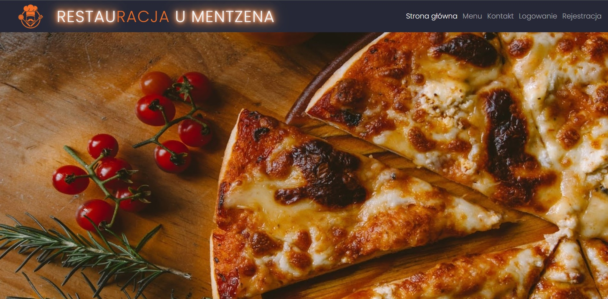
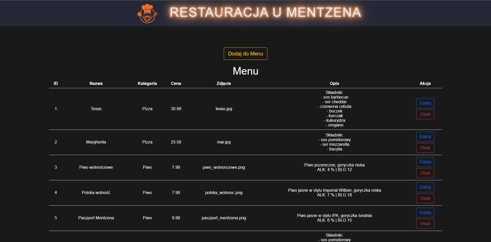
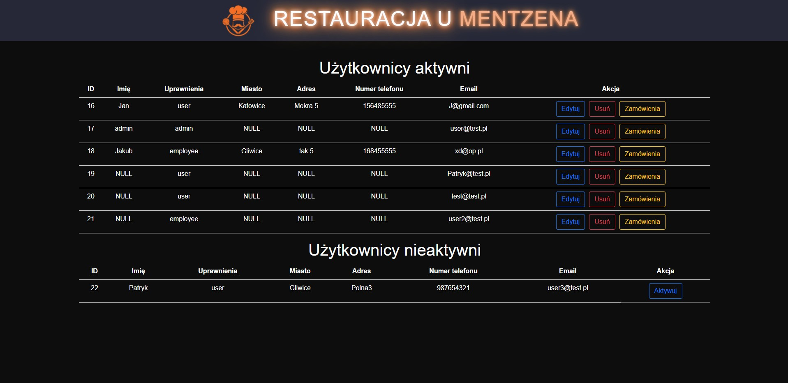
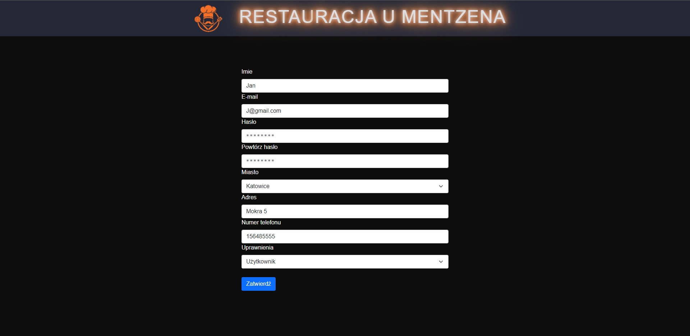
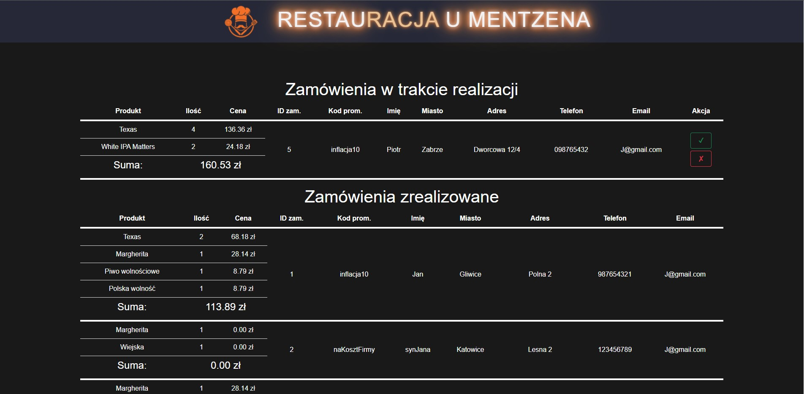

# PHP_Restaurant
## Restaurant overview

Project made in group of 4 students for PHP classes. Tech stack: HTML, CSS, PHP, Bootstrap, MySQL.

Website of a pizzeria for ordering meals with delivery. Website has administrator and employee panel.
Administrator panel allows owners to manage menu and users. Employee panel allows to mark order as finished or cancelled.

## Preview images

    Home page

    Menu editing in administrator panel

    List of users in administrator panel

    Editing user in administrator panel

    List of orders of a user in administrator panel

